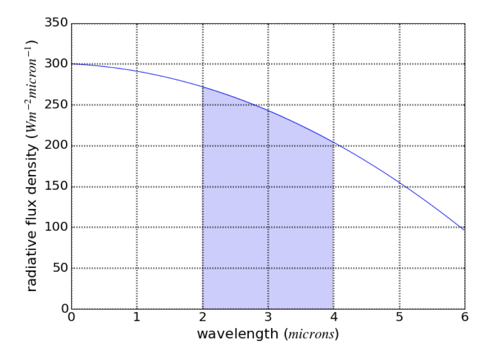
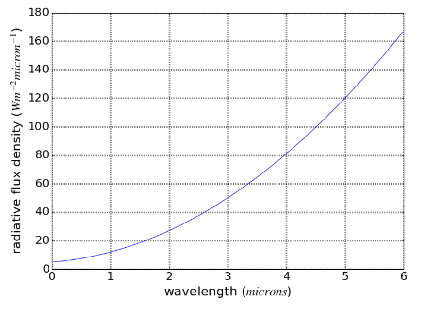
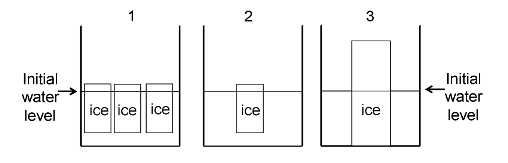
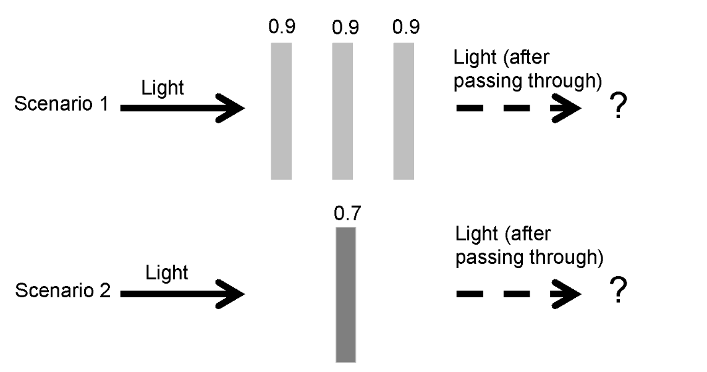

+++ {"ctype": "quiz", "title": "EOSC 340 Quiz", "allowed_attempts": 1, "scoring_policy": "keep_highest", "cant_go_back": false, "shuffle_answers": false}

# EOSC 340 - Global Climate Change: End-of-Term Assessment
Please answer the following questions to the best of your ability. Your answers to these questions, paired with responses earlier in the term, will help us evaluate how useful the class activities have been for your learning. If you don’t know, you can choose “I do not know”.  Thank you!

+++ {"ctype": "group", "name": "general"}

## Questions

+++ {"ctype": "question", "quesnum": 1, "question_type": "multiple_answers_question"}

### Question 1
Which is the best definition of a positive feedback loop in the climate system?

* A change in the climate system leads to a response that benefits climate change.
* A change in the climate system leads to a response that slows down climate change.
* A change in the climate system leads to a response that speeds up climate change.
* A change in the climate system leads to a response that harms climate change.
* I do not know.

+++ {"ctype": "answer", "quesnum": 1}

Answers
* False
* False
* True
* False
* False

+++ {"ctype": "question", "quesnum": 2, "question_type": "multiple_answers_question"}

### Question 2
Averaged over long time periods, how does the amount of energy arriving from space compare to the amount of energy leaving Earth?

* The amount of energy arriving from space is greater than the amount of energy leaving Earth.
* The amount of energy arriving from space is less than the amount of energy leaving Earth.
* The amount of energy arriving from space is roughly equal to the amount of energy leaving Earth.
* I do not know.

+++ {"ctype": "answer", "quesnum": 2}

Answers
* False
* False
* True
* False

+++ {"ctype": "question", "quesnum": 3, "question_type": "multiple_answers_question"}

### Question 3
What would you do to solve the following problem? Suppose a tub has an inflow of water of 10 $kg/hour$ and an outflow of water that increases with time by 2$t$ $kg/hour$, where $t$ is the time in hours. At the beginning (time = 0), the tub is empty. What is the mass $M$ of water in the tub after 2 hours? That is, what is $M$ after 2 hours if:

\( $\frac{dM}{dt} \) = 10 - 2t$

*For this, the question is "what would you do to solve this problem?"* 

* Integrate dM/dt from t=0 to t=2 hours 
* Evaluate dM/dt at t=2 hours 
* Set dM/dt=0 and solve for t
* Take the derivative of dM/dt and evaluate at t=2 hours
* Not use calculus and just reason out a solution
* I do not know.

+++ {"ctype": "answer", "quesnum": 3}

Answers
* True
* False
* False
* False
* False
* False

+++ {"ctype": "question", "quesnum": 4, "question_type": "multiple_answers_question"}

### Question 4
Now, solve the problem in Question 3 above.  What is the mass $M$ of water in the tub after 2 hours?  

* 0 kg
* 5 kg
* 6 kg
* 14 kg
* 16 kg
* I do not know. 

+++ {"ctype": "answer", "quesnum": 4}

Answers
* False
* False
* False
* False
* True
* False

+++ {"ctype": "question", "quesnum": 5, "question_type": "multiple_choice_question"}

### Question 5
Which is the most common form of radiation given off by Earth's surface?

* The Earth’s surface mostly gives off visible radiation.
* The Earth’s surface mostly gives off infrared radiation.
* The Earth’s surface mostly gives off ultraviolet radiation.
* Earth’s surface does not give off radiation.
* I do not know.

+++ {"ctype": "answer", "quesnum": 5}

Answers
* False
* True
* False
* False
* False

+++ {"ctype": "question", "quesnum": 6, "question_type": "multiple_choice_question"}

### Question 6
How much incoming sunlight do greenhouse gases absorb?

* Greenhouses gases absorb almost no incoming sunlight.
* Greenhouses gases absorb about half of the incoming sunlight.
* Greenhouses gases absorb most incoming sunlight.
* I do not know.

+++ {"ctype": "answer", "quesnum": 6}

Answers
* True
* False
* False
* False

+++ {"ctype": "question", "quesnum": 7, "question_type": "multiple_choice_question"}

### Question 7
A pail of water at temperature T (in Kelvin) emits thermal radiation F ($Wm^{-2}$) according to: $F = σT^4$ where $σ=5.67 x 10^{-8} Wm^{-2}K^{-4}$ is a constant. What is \frac{dF}{dt}, the rate of change of radiative flux with temperature, when T = 300K? 

* 0.5 $Wm^{-2}K^{-1}$
* 1.5 $Wm^{-2}K^{-1}$
* 3 $Wm^{-2}K^{-1}$
* 6 $Wm^{-2}K^{-1}$
* 12 $Wm^{-2}K^{-1}$
* I do not know.

+++ {"ctype": "answer", "quesnum": 7}

Answers
* False
* False
* False
* True
* False
* False

+++ {"ctype": "question", "quesnum": 8, "question_type": "multiple_choice_question"}

### Question 8
Which of the following is the best definition of a greenhouse gas?

* An atmospheric gas that is produced as plants grow.
* An atmospheric gas that absorbs infrared radiation.
* An atmospheric gas that produces acid rain.
* An atmospheric gas that absorbs ultraviolet radiation.
* I do not know.

+++ {"ctype": "answer", "quesnum": 8}

Answers
* False
* True
* False
* False
* False

+++ {"ctype": "question", "quesnum": 9, "question_type": "multiple_choice_question"}

### Question 9
Where will a photon emitted by a greenhouse gas molecule most likely go? 

* In an upward direction relative to Earth’s surface.
* In a downward direction relative to Earth's surface.
* In a random direction relative to Earth’s surface.
* I do not know.

+++ {"ctype": "answer", "quesnum": 9}

Answers
* False
* False
* True
* False

+++ {"ctype": "question", "quesnum": 10, "question_type": "multiple_choice_question"}

### Question 10
Consider the following parabola, given by: $y(x) = -5x^2 - 4x + 300$. What is the integral under this curve between x = 2 and x = 4? (i.e. the area of the shaded rectangle below)

* 223
* 331
* 483
* 582
* 676
* I do not know.

+++ {"ctype": "answer", "quesnum": 10}

Answers
* False
* False
* True
* False
* False
* False

+++ {"ctype": "question", "quesnum": 11, "question_type": "multiple_choice_question"}

### Question 11
The integral in question 10 above has units of:

* microns
* inverse microns ($microns^{-1}$)
* Watts per square meter ($Wm^{-2}$)
* 1/(Watts per square meter) ($1/ Wm^{-2}$)
* Watts ($W$)
* I do not know.

+++ {"ctype": "answer", "quesnum": 11}

Answers
* False
* False
* True
* False
* False
* False

+++ {"ctype": "question", "quesnum": 12, "question_type": "multiple_choice_question"}

### Question 12
For the function drawn below, approximately what is the integral between wavelengths of 4 to 5 microns?

* 35-55
* 55-75
* 75-95
* 95-105
* 105-115
* I do not know.

+++ {"ctype": "answer", "quesnum": 12}

Answers
* False
* False
* False
* True
* False
* False

+++ {"ctype": "question", "quesnum": 13, "question_type": "multiple_choice_question"}

### Question 13
A single ice cube of mass $9.2g$ floats in a glass that contains 350 $cm^3$ of water (density of water is $1.0 * 103 kg m^{-3}$). Given that the density of ice is $0.92 * 103 kg m^{-3}$, what volume of water does the ice cube displace?

* 8.8 cubic centimeters
* 9.0 cubic centimeters
* 9.2 cubic centimeters
* 9.4 cubic centimeters
* need more information
* I do not know. 

+++ {"ctype": "answer", "quesnum": 13}

Answers
* False
* False
* True
* False
* False
* False

+++ {"ctype": "question", "quesnum": 14, "question_type": "multiple_choice_question"}

### Question 14
Below are three glasses of water with ice in them. The initial water levels in all three glasses are the same.  Then imagine that the ice melts. Rank the water levels in the three glasses after the ice melts.  

* 1=2<3 (1 and 2 will be equal to each other and lower than 3; 3 will have the highest level)
* 2<1<3 (2 will have the lowest level; 3 will have the highest level; 1 will be in between) 
* 2<1=3 (2 will have the lowest level; 1 and 3 will be equal to each other and higher than 2)
* 1=2=3 (The water levels in all three glasses will be equal to each other)
* I do not know. 

+++ {"ctype": "answer", "quesnum": 14}

Answers
* True
* False
* False
* False
* False

+++ {"ctype": "question", "quesnum": 15, "question_type": "multiple_choice_question"}

### Question 15
Which of the following statements about air temperature change over the past million years is most accurate?

* Air temperature change over the past million years is slightly due to natural processes and mostly due to human activities.
* Air temperature change over the past million years is mostly due to natural processes and slightly due to human activities.
* Air temperature change over the past million years is about equally due to natural processes and human activities.
* Air temperature change over the past million years has not occurred whether due to natural processes or human activities.
* I do not know.

+++ {"ctype": "answer", "quesnum": 15}

Answers
* False
* True
* False
* False
* False

+++ {"ctype": "question", "quesnum": 16, "question_type": "multiple_answers_question"}

### Question 16
Which statements about non-greenhouse gases are accurate? **CHOOSE ALL THAT APPLY.**

* Non-greenhouse gases do not absorb a lot of energy given off by the Sun.
* Non-greenhouse gases do not absorb a lot of energy given off by the Earth.
* Non-greenhouse gases absorb a lot of energy given off by the Earth.
* Non-greenhouse gases absorb a lot of energy given off by the Sun.
* I do not know.

+++ {"ctype": "answer", "quesnum": 16}

Answers
* True
* True
* False
* False
* False

+++ {"ctype": "question", "quesnum": 17, "question_type": "multiple_choice_question"}

### Question 17
What do greenhouse gases do?

* Greenhouse gases absorb energy emitted by Earth.
* Greenhouse gases reflect energy emitted by Earth.
* Greenhouse gases reflect energy reflected by Earth.
* Greenhouse gases absorb energy reflected by Earth.
* I do not know.

+++ {"ctype": "answer", "quesnum": 17}

Answers
* True
* False
* False
* False
* False

+++ {"ctype": "question", "quesnum": 18, "question_type": "multiple_choice_question"}

### Question 18
What is the value of $x$ if $x = -30 - (-40)$?

* -70
* -10
* 10
* 70
* I do not know.

+++ {"ctype": "answer", "quesnum": 18}

Answers
* False
* False
* True
* False
* False

+++ {"ctype": "question", "quesnum": 19, "question_type": "multiple_choice_question"}

### Question 19
Below are two scenarios in which light is passing through panes of glass.  The three panes of glass in Scenario 1 each have the property that they let 0.9 (90%) of the light pass through.  The one pane of glass in Scenario 2 has the property that it lets 0.7 (70%) of the light pass through.  In both scenarios, the initial amount of light is the same - before the light goes through the panes of glass.  

Comparing the two scenarios, which of the following statements is **TRUE**?  After the light passes through the panes of glass, there will be ________.

* more light coming out the right-hand side for Scenario 1 than for Scenario 2
* more light coming out the right-hand side for Scenario 2 than for Scenario 1
* the same amount of light coming out the right-hand side for Scenario 1 and Scenario 2
* I do not know.

+++ {"ctype": "answer", "quesnum": 19}

Answers
* True
* False
* False
* False

+++ {"ctype": "question", "quesnum": 20, "question_type": "multiple_choice_question"}

### Question 20
If dz/dy is negative and dy/dx is negative, what is the sign of dz/dx? 

* negative
* positive
* could be either negative or positive
* not enough information
* I do not know.

+++ {"ctype": "answer", "quesnum": 20}

Answers
* False
* True
* False
* False
* False

+++ {"ctype": "question", "quesnum": 21, "question_type": "multiple_choice_question"}

### Question 21
Imagine someone running on a hot day.  Their body temperature goes up and they start to sweat.  We could write that:

$\frac{d(sweat)}{d(temperature)}$

has a positive sign, because as body temperature increases, sweat also increases \frac{+}{+}=(+).  And, as body temperature decreases, sweat also decreases \frac{-}{-}=(+).  

When a person sweats, the sweat on their skin then evaporates and that evaporation changes their body temperature.  Thinking about the relationships between sweat, evaporation, and body temperature, what would be the sign of:

\( $\frac{d(sweat)}{d(temperature)} \) * \( \frac{d(evaporation)}{d(sweat)} \) * \( \frac{d(temperature)}{d(evaporation)}$? \)

* negative
* positive
* could be either negative or positive
* not enough information
* I do not know.

+++ {"ctype": "answer", "quesnum": 21}

Answers
* True
* False
* False
* False
* False